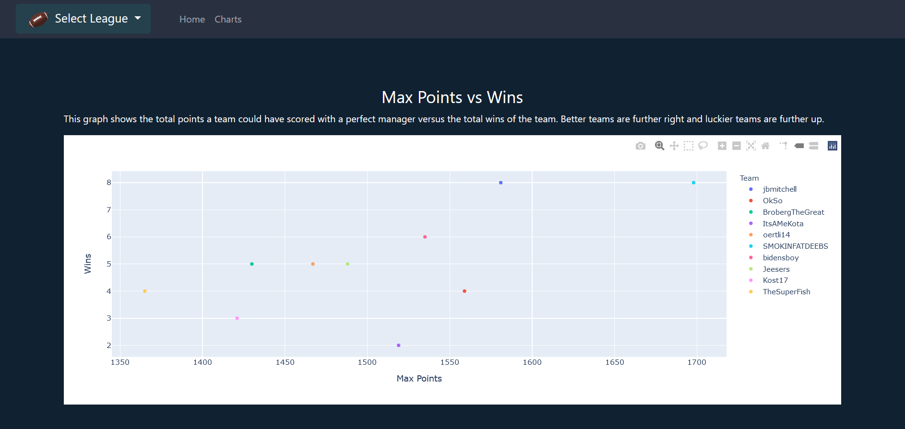

# Sleeper Fantasy Football Season Breakdown
This is a Flask application that uses the Sleeper public API.

It displays wins, max points, and percentage of max points on individual Sleeper fantasy leagues as Plotly graphs.

